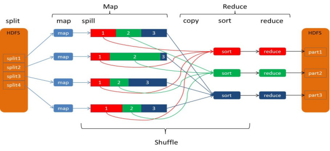

# mapreduce各阶段使用的排序算法，思路

整体流程分为三部分

​	map ->shuffle->reduce

map 端的排序

.jpg)

官网上指出了map端输出的是排序过的数据。

那么map的排序发生在哪呢？

每个map会生成至多一个文件（如果都被filter掉,会不生成文件?）这个文件是按partition和key排过序的。

0 对map输出的key进行分区（partition），指定该key数据发给哪个reduce

1 map 向buffer 写数据

2 buffer达到阈值（默认80%）,启动进程，将buffer中的数据根据partition和key排序，然后写到磁盘（spill）

3 map继续向剩余的buffer写数据,重复上述步骤，可能写多个文件

4 将spill的文件里的数据排序并merge成一个文件

因此排序发生在2,4两个阶段

2 使用快排

4 使用归并/堆排序？

reduce 端的排序

.jpg)

官网说明 reduce分为三个阶段 shuffle，sort 和reduce

1 shuffle: reduce 去拉取map的输出的文件中对应自己partition的部分

2 merge: 不断合并从map获取到的数据并排序

​	2.1 从map拉取的数据放到buffer中，buffer达到阈值，开始排序写文件

​	2.2 reduce 拉取完成所有需要的map数据，进行merge，最终reduce的输入是一个有序文件

3 reduce: 处理自己组内数据的reduce逻辑,官网说明了reduce 的输出默认是未排序的

因此reduce 的排序发生在 2 阶段

2.1使用快排

2.2 使用归并

举个例子

| id   | name | gender |
| ---- | ---- | ------ |
| 1    | ls   | M      |
| 2    | zzq  | M      |
| 3    | clc  | F      |

select gender,count(1) from people group by gender;

map输出<M,1>,<M,1>,<F,1>

生成文件(颜色表示相同key属于相同分区)

假设有两个reduce

一个输出<F,1>，一个输出<M,2>

我理解reduce结果不排序是说多个reduce之间的数据不排序

也就是说可能输出

| F    | 1    |
| ---- | ---- |
| M    | 2    |

也可能输出

| M    | 2    |
| ---- | ---- |
| F    | 1    |

讨论

map端的sort有什么用？

reference:

[https://blog.csdn.net/asn_forever/article/details/81233547](https://blog.csdn.net/asn_forever/article/details/81233547)

[https://blog.csdn.net/u014374284/article/details/49205885](https://blog.csdn.net/u014374284/article/details/49205885)

[http://hadoop.apache.org/docs/stable/hadoop-mapreduce-client/hadoop-mapreduce-client-core/MapReduceTutorial.html](http://hadoop.apache.org/docs/stable/hadoop-mapreduce-client/hadoop-mapreduce-client-core/MapReduceTutorial.html)

[https://ai.google/research/pubs/pub62](https://ai.google/research/pubs/pub62)

[https://data-flair.training/blogs/shuffling-and-sorting-in-hadoop/](https://data-flair.training/blogs/shuffling-and-sorting-in-hadoop/)

[https://stackoverflow.com/questions/11746311/where-is-sort-used-in-mapreduce-phase-and-why](https://stackoverflow.com/questions/11746311/where-is-sort-used-in-mapreduce-phase-and-why)

[https://www.quora.com/Which-sorting-algorithm-is-used-in-MapReduce-Hadoop](https://www.quora.com/Which-sorting-algorithm-is-used-in-MapReduce-Hadoop)
