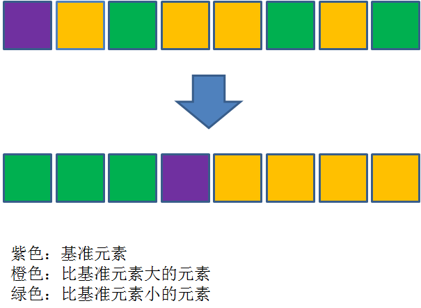
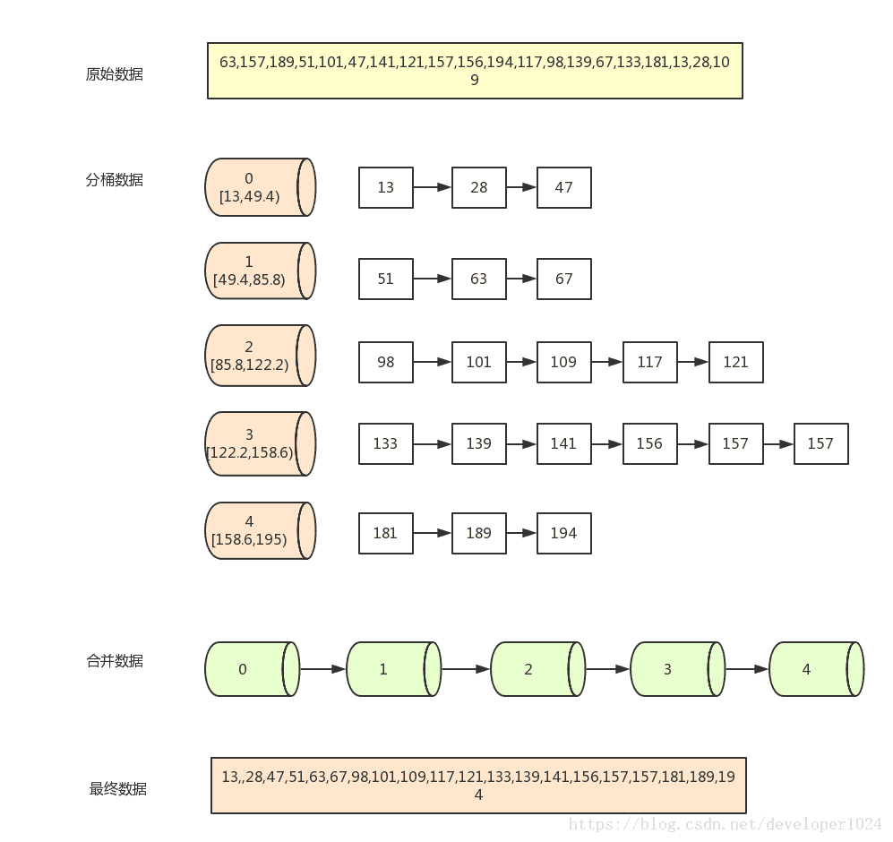

# 常见排序

## 1 快速排序

1 先从数列中取出一个数作为基准数。

2 分区过程，将比这个数大的数全放到它的右边，小于或等于它的数全放到它的左边。

3 再对左右区间重复第二步，直到各区间只有一个数。

时间复杂度 O(nlog2n)

reference:

[http://www.sohu.com/a/246785807_684445](http://www.sohu.com/a/246785807_684445)

[https://blog.csdn.net/morewindows/article/details/6684558](https://blog.csdn.net/morewindows/article/details/6684558)

## 2 归并排序

1 将待排数组一分为二

2 递归对子序列做同(1) 的操作

3 按顺序合并子序列

时间复杂度 O(nlog2n)

reference:

[https://www.cnblogs.com/chengxiao/p/6194356.html](https://www.cnblogs.com/chengxiao/p/6194356.html)

[https://www.cnblogs.com/wangprince2017/p/7663457.html](https://www.cnblogs.com/wangprince2017/p/7663457.html)

## 3 桶排序

1 遍历数组,获取最大最小值

2 跨度 = max -min,间隔 = 跨度/带排数据长度

3 每个桶内排序

4 按桶的顺序依次输出

时间复杂度: O(n+m+n(logn-logm)）

reference :

[https://www.sohu.com/a/259503781_684445](https://www.sohu.com/a/259503781_684445)

[https://blog.csdn.net/developer1024/article/details/79770240](https://blog.csdn.net/developer1024/article/details/79770240)

## 4 堆排序

1 构建堆

2 堆中加入新元素

3 调整堆

主要解决流式数据中topN的问题:就是实时的接进来一批数据，我需要得到前N大的元素，用堆来缓存这N个元素，再有新元素进来，再调整。

时间复杂度:O(nlogn)

reference:

[https://www.cnblogs.com/chengxiao/p/6129630.html](https://www.cnblogs.com/chengxiao/p/6129630.html)